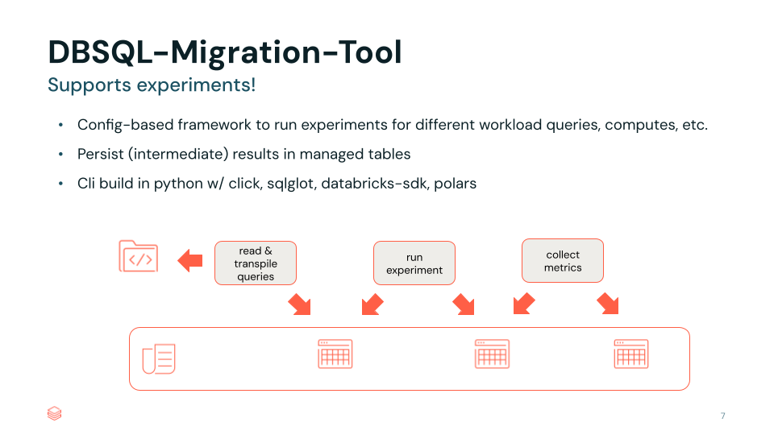

# databricks-sql-migration-tool

This project contains a simple CLI to enable query transpilation & experiments to assess query performance
when performing migrations to DBSQL.



## how to

#### Install dependencies
```shell
pip install poetry
poetry install
```


#### Define configuration
This project installs a CLI which needs a `yaml` based configuration.
A sample configuration can be found in `config.example.yaml`.
The example config also contains a short description of each configuration value.


#### Transpile SQL queries
```shell
dbsql-migration-tool transpile --config config.yaml
```
With the above command you instruct to transpile SQL queries from a 
source dialect to a target dialect. Transpilation is done with `sqlglot`.
Queries can optionally be persisted to SQL-Scripts.
Results of the transpilation run, including the transpiled queries, will be
persisted into Unity-Catalog. You will find the following table: `<your catalog>.workload_<workload-number>_<run-name>.transpile`.

#### Run experiment with transpiled SQL queries
```shell
dbsql-migration-tool experiment --config config.yaml
```
With the above command you instruct to run an experiment with the previously transpiled
SQL-queries. Queries are retrieved from the UC table you persisted in the
previous step, based on the `workload` and `name` configurations. Experiments can be configured to run with parallelism. See the example config-file
for available settings. Results of the experiment run, will be
persisted into Unity-Catalog. You will find the following table: `<your catalog>.workload_<workload-number>_<run-name>.experiment`.


#### Collect results of an experiment
```shell
dbsql-migration-tool result --config config.yaml
```
With the above command you instruct to collect results of an experiment. Exoeriment reults are retrieved from the UC table you persisted in the
previous step, based on the `workload` and `name` configurations as well as from the system table for query history `system.query.history` in UC.
Unfortunately, the query statistics available in the query-history table are not immediately available after a query was run.
So if you run the `result` command right after the `experiment` command, it is likely that you will not see any results.

Results will be
persisted into Unity-Catalog. You will find the following table: `<your catalog>.workload_<workload-number>_<run-name>.result`.
